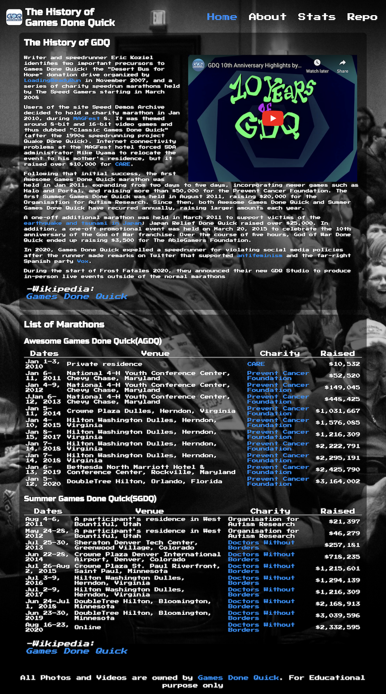
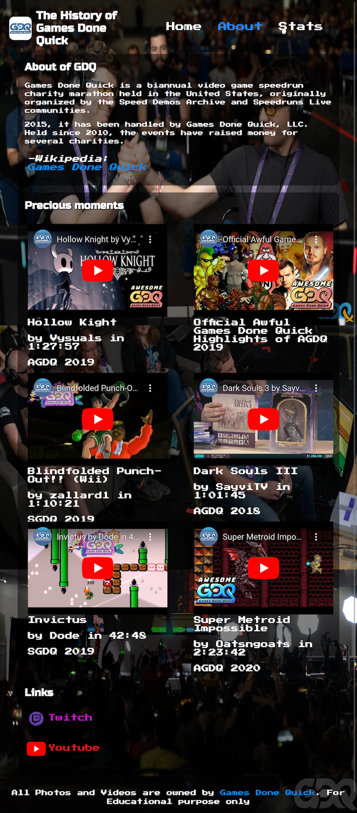
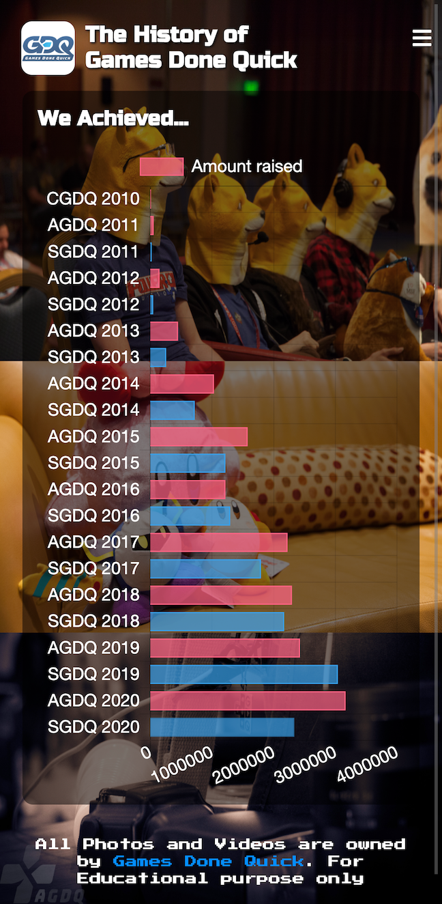

# History of Games Done Quick

## Overview
Web page for introducing speedrun event, Games Done Quick.
WMAD401 Project1

## [Deployed](https://rowaxl.github.io/HistoryOfGDQ/index.html)

## [Wireframe](https://www.figma.com/file/hmZ96IKfsm5rOBfa46FDtG/History-of-GDQ?node-id=0%3A1)

## Pages
- index
  - History of GDQ.
  - With responsive tables of events.
- about
  - Brief introduce of GDQ.
  - Popular runs with flex display
- stats
  - Graph of fund-raised of events.

## Screens

### Desktop (1024px ~)

### Tablet (768 ~ 1024px)

### Mobile (~ 768px)

### Attention
Embeded Youtube videos occur error of chrome cast extensions.